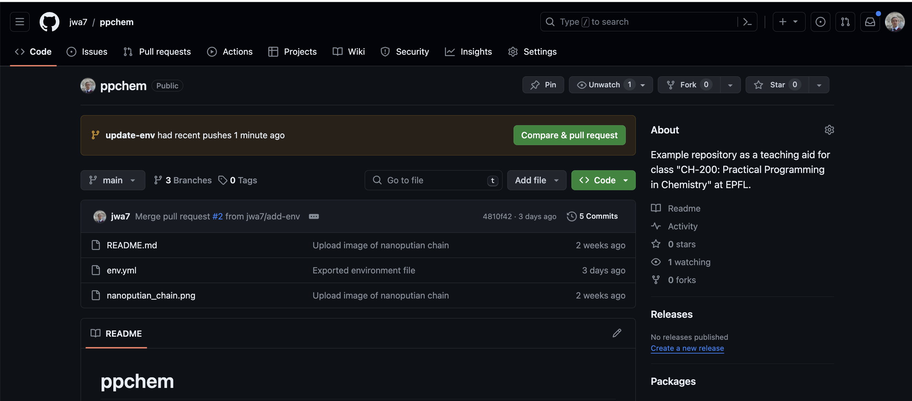
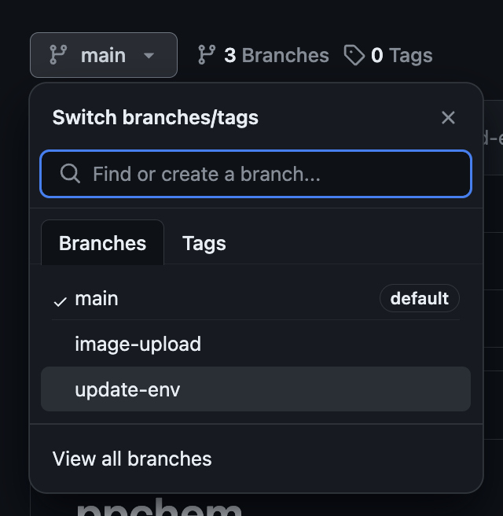
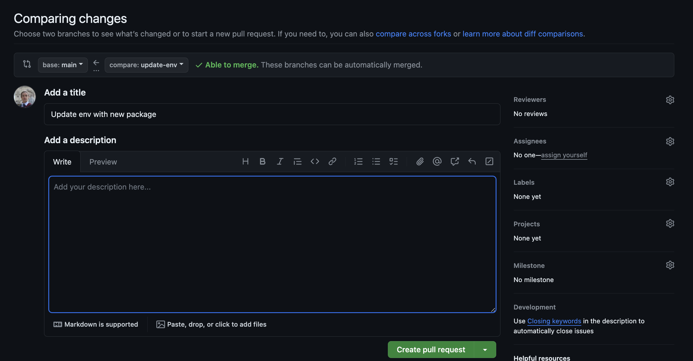
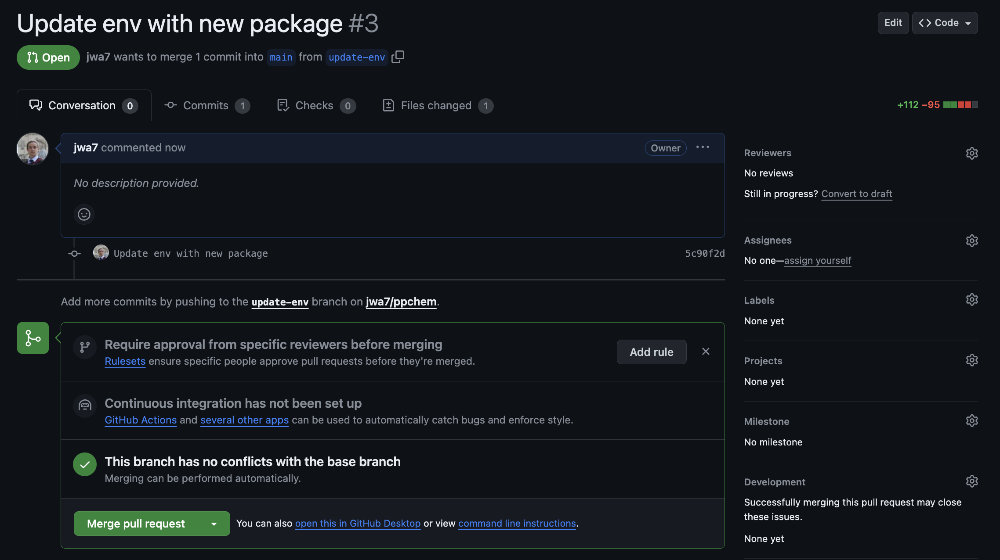

# Week 4: Setup

Welcome to week 4! Before running the exercise, we need to do a bit of set up. This week
we'll be learning about the Python modules `numpy`, `pandas`, and `matplotlib`.

If you think back to week 1, when we set up our conda environment, you'll remember that
we installed certain packages. More specifically, in the file
<<<<<<< HEAD
(week_01/README.md)[https://github.com/schwallergroup/practical-programming-in-chemistry-exercises/tree/main/week_01],
=======
[week_01/README.md](https://github.com/schwallergroup/practical-programming-in-chemistry-exercises/tree/main/week_01),
>>>>>>> 52ffef64fad52b6491d809afbccad1b6693ccc6a
we ran the following commands:

```
conda create -n ppchem python=3.10
conda activate ppchem
pip install pandas  # installs numpy as dependency
pip install rdkit==2022.09.5
pip install jupyterlab
```

You can see that by running these, in our environment `ppchem`, we should already have
`numpy` and `pandas` installed. Open a terminal / powershell / command line prompt,
`conda activate ppchem` (or whatever you called your environment) and run the command
`conda list`. The output should look something like this (output shortened):

```
# packages in environment at /opt/miniforge3/envs/ppchem:
#
# Name                    Version                   Build  Channel
anyio                     4.2.0                    pypi_0    pypi
appnope                   0.1.4                    pypi_0    pypi
...
jupyterlab                4.1.0                    pypi_0    pypi
...
numpy                     1.26.4                   pypi_0    pypi
...
pandas                    2.2.0                    pypi_0    pypi
pandocfilters             1.5.1                    pypi_0    pypi
parso                     0.8.3                    pypi_0    pypi
pexpect                   4.9.0                    pypi_0    pypi
pillow                    10.2.0                   pypi_0    pypi
pip                       24.0               pyhd8ed1ab_0    conda-forge
...
websocket-client          1.7.0                    pypi_0    pypi
wheel                     0.42.0             pyhd8ed1ab_0    conda-forge
xz                        5.2.6                h57fd34a_0    conda-forge
```

and you should be able to see `numpy` and `pandas` there.


## Milestone: installing new packages and updating the environment file

**Note**: this section assumes that you are up to date with your milestones, and have
<<<<<<< HEAD
pushed your exported environment file to your *personal fork* of the
`practical-programming-in-chemistry-milestones` repository. If this is not the case,
=======
pushed your exported environment file to your personal
`ppchem` repository. If this is not the case,
>>>>>>> 52ffef64fad52b6491d809afbccad1b6693ccc6a
make sure you have followed all of the instructions in the Week 1 exercises.

Then, follow these instructions:

1. In your terminal / powershell application, navigate to your personal
<<<<<<< HEAD
`<username>/practical-programming-in-chemistry-milestones` repository.
=======
`<username>/ppchem` repository.
>>>>>>> 52ffef64fad52b6491d809afbccad1b6693ccc6a
1. Make sure you have activated your environment: `conda activate ppchem` (or whatever
   you named your env)
1. Install the new package: `pip install matplotlib`
1. Create a new branch: `git checkout -b update-env`
1. Export the environment file: `conda env export > env.yml`
1. Inspect the changes to the environment file compared to the last commit. This can be
   done by running `git diff env.yml`. Use your arrow keys to scroll. There may be a few
   changes, but most importantly you should see a line like: `+      -
   matplotlib==3.8.3`. This tells us that, relative to the last commit, matplotlib has
   been installed in the environment, at version number `3.8.3`. Press `q` to quit the
   git diff viewer.
1. Add the changes: `git add env.yml`
1. Commit them with a meaningful message: `git commit -m "Updated environment to include
   matplotlib"`
1. Push to your fork. As the remote doesn't yet know that we have created the branch
   `update-env` locally, we need to push with: `git push --set-upstream origin
   update-env`
   
Navigate to your repository on Github, at URL:
<<<<<<< HEAD
`https://github.com/<username>/practical-programming-in-chemistry-milestones`. You should
see a green button "Compare & pull request" like below:


Click this, and you'll arrive at the `Comparing changes` screen:


As we want to update our personal fork of the repository, not the repository owned by
`schwallergroup`, we need to change the base repository to
`<username>/practical-programming-in-chemistry-milestones`


Add a short description, then click "Create pull request":


Hopefully you should see that "The branch has no conflicts with the base branch" (if
not, speak to us). You can then merge your changes into the main branch by clicking
"Merge pull request".
=======
`https://github.com/<username>/ppchem`. You should
see a page like this:



Click the branch drop down menu where it says "main" to select a branch, and select the
branch "update-env":



You should see that your branch `update-env` is 1 commit ahead of main. We want to
create a pull request for this branch, so will click on the "contribute" button, and
select "Open pull request":


this will open a new page for opening a pull request:



Make sure you add a title and a short description of your pull request - i.e the changes
you have made and want to merge. Then, select "Create pull request". This will take you
to the pull request page.

On this page, this is typically where code reviews will be posted. Usually, if you are
contributing to an open source package, and want to merge some of your changes into the
main branch of the code, someone will review your work, request changes and leave
comments. This all happens on this page. 

As this is just your personal repository and the changes to the code weren't
significant, for now we will not do any review and just merge into main. Select "Merge
pull request":



and "Confirm merge":


then your pull request is merged! You can safely delete the branch associated with the
PR, as all the changes are now in main:


The pull request is accessible in the "Pull Requests" tab of the main repository page,
but will be in the 'closed' section.

Navigate back to your main repository landing page, i.e.
`https://github.com/<username>/ppchem` and check that the changes are there:


>>>>>>> 52ffef64fad52b6491d809afbccad1b6693ccc6a

Finally, update the "Open a pull request" row of your Personal Milestones table with the
URL of the pull request.

For example, the URL of my (Joe's) PR was:
<<<<<<< HEAD
https://github.com/jwa7/practical-programming-in-chemistry-milestones/pull/2 

=======
[https://github.com/jwa7/ppchem/pull/3](https://github.com/jwa7/ppchem/pull/3)
>>>>>>> 52ffef64fad52b6491d809afbccad1b6693ccc6a

Good job! Now onto the week 4 exercises...
